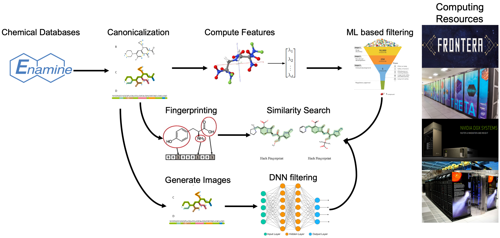

# The nCov-Group Data Repository
{: .fs-9 .no_toc }

## AI- and HPC-enabled Generated Leads for SARS-CoV-2 Drugs
{: .no_toc }

This repository provides access to data, models, and code produced by the **nCoV Group** in support of research aimed at generating leads for potential SARS-CoV-2 drugs. The data include representations and computed descriptors for around **2.8 billion** small molecules: some 30 TB of data in all, although many useful subsets are much smaller.

These data will be updated regularly as the collaboration produces new results. Shared data are located on the ALCF Petrel data store [at this location](https://app.globus.org/file-manager?origin_id=a386b552-6086-11ea-9688-0e56c063f437&origin_path=%2Frelease%2F), from where they can be retrieved via [Globus](https://www.globus.org). To access the data, users can register for a free Globus account ([here](<https://www.globus.org>)).

## Table of contents
{: .no_toc }

* TOC
{:toc}

Note:
{: .label .label-green }
A manuscript describing these data and the associated methodology and processing pipelines is under preparation. A link will be posted here when it is available.

## Data Processing Pipeline
The data processing pipeline is used to compute different types of features and representations of billions of small molecules.  The pipeline first converts the SMILES representation for each molecule to **a canonical SMILES form**. (De-duplication is in progress.) It then creates, for each molecule, three different types of features:
1) **molecular fingerprints** that encode the structure of molecules;
2) **molecular descriptors** (using [Mordred](<https://github.com/mordred-descriptor/mordred)); and
3) **2D images** of the molecular structure.  These features are being used as input to various machine learning and deep learning models that predict important characteristics including docking scores, toxicity, and more.

---

## Dataset Catalog
We have obtained molecule definitions from the following source datasets.
For each, we provide a links to the original work and the number of molecules included from the dataset.

Key | Description and link | # Molecules
----- | --- | --:
BDB | [The Binding Database](https://www.bindingdb.org/bind/index.jsp) | 1,813,538 
CAS | [CAS COVID-19 Antiviral Candidate Compounds](https://www.cas.org/covid-19-antiviral-compounds-dataset) | 49,437
DCL | [DrugCentral Online Drug Compendium](http://drugcentral.org) | 3,981 
DBK | [Drugbank](https://www.drugbank.ca) | 9,678 
DUD | [DUDE database of useful decoys](http://dude.docking.org) | 99,782 
E15 | 15.5M-molecule subset of ENA | 15,547,091 
EDB | DrugBank plus [Enamine Hit Locator Library 2018](https://enamine.net/hit-finding/diversity-libraries/hit-locator-library-300) | 310,782
EMO | [eMolecules](https://www.emolecules.com/info/products-data-downloads.html) | 25,946,988
ENA | [Enamine REAL Database](https://enamine.net/library-synthesis/real-compounds/real-database) | 1,211,723,723
FFI | [CureFFI FDA-approved drugs and CNS drugs](https://www.cureffi.org/2013/10/04/list-of-fda-approved-drugs-and-cns-drugs-with-smiles/) | 1,497 
G13 | [GDB-13 small organic molecules up to 13 atoms of C, N, O, S and Cl](http://gdb.unibe.ch/downloads/)| 977,468,301
G17 | [GDB-17-Set subset of up to 17 atom extension of GDB-13](http://gdb.unibe.ch/downloads/)| 50,000,000
HOP | [Harvard Organic Photovoltaic Dataset](https://www.nature.com/articles/sdata201686) | 350
L1K | [L1000](http://www.lincsproject.org) | 10,141 |
MOS | [Molecular Sets (MOSES)](https://github.com/molecularsets/moses) | 1,936,962
PCH | [PubChem](https://www.ncbi.nlm.nih.gov/guide/data-software/) | 97,545,266
QM9 | [QM9 subset of GDB-17](http://quantum-machine.org/datasets/) | 133,885
REP | [Repurposing related drug and tool compound annotations](https://clue.io/data/REP#REP) | 6,244
SAV | [Synthetically Accessible Virtual Inventory (SAVI)](https://cactus.nci.nih.gov/download/savi_download/) | 265,047,097
SUR | [SureChEMBL dataset of molecules from patents](https://surechembl.org/) | 17,915,384
ZIN | [ZINC15](http://zinc15.docking.org) | 1,225,804,829
    |        | **3,891,374,956** 

Notes:
{: .label .label-blue }
* The key for each dataset may be used in filenames in place of the full name in downloads elsewhere. 
* The numbers above may be less than what can be found at the source, due to conversion failures and/or version differences.
* These numbers are not adjusted for duplicates, within or between datasets.

## Dataset Downloads
The data are organized in four major directories, containing
[canonical SMILES](https://app.globus.org/file-manager?destination_id=a386b552-6086-11ea-9688-0e56c063f437&destination_path=%2Frelease%2Fv1.0%2Fcanonical_smiles%2F), [molecular fingerprints](https://app.globus.org/file-manager?destination_id=a386b552-6086-11ea-9688-0e56c063f437&destination_path=%2Frelease%2Fv1.0%2Ffingerprints%2F), [descriptors](https://app.globus.org/file-manager?destination_id=a386b552-6086-11ea-9688-0e56c063f437&destination_path=%2Frelease%2Fv1.0%2Fdescriptors%2F), and [images](https://app.globus.org/file-manager?destination_id=a386b552-6086-11ea-9688-0e56c063f437&destination_path=%2Frelease%2Fv1.0%2Fimages%2F) (png format), respectively.
Follow the links below to access subdirectories organized by dataset.

Key | Canonical SMILES | Fingerprints | Descriptors | Images
----- | --- | --- | ---  | ---
CAS | [1 file, 7 MB](https://app.globus.org/file-manager?origin_id=a386b552-6086-11ea-9688-0e56c063f437&origin_path=/release/v1.0/canonical_smiles/CAS/) | [2 files, 8 MB](https://app.globus.org/file-manager?origin_id=a386b552-6086-11ea-9688-0e56c063f437&origin_path=/release/v1.0/fingerprints/CAS/) | [2 files, 8 MB](https://app.globus.org/file-manager?origin_id=a386b552-6086-11ea-9688-0e56c063f437&origin_path=/release/v1.0/fingerprints/CAS/) | TBD | 
DBK | [1 file, 650 KB](https://app.globus.org/file-manager?origin_id=a386b552-6086-11ea-9688-0e56c063f437&origin_path=/release/v1.0/canonical_smiles/DBK/) | [4 files, 6 MB](https://app.globus.org/file-manager?origin_id=a386b552-6086-11ea-9688-0e56c063f437&origin_path=/release/v1.0/fingerprints/DBK/) | [4 files, 6 MB](https://app.globus.org/file-manager?origin_id=a386b552-6086-11ea-9688-0e56c063f437&origin_path=/release/v1.0/fingerprints/DBK/) | [2 files, 476 MB](https://app.globus.org/file-manager?origin_id=a386b552-6086-11ea-9688-0e56c063f437&origin_path=/release/v1.0/images/DBK/) | 
DCL | [1 file, 260 KB](https://app.globus.org/file-manager?origin_id=a386b552-6086-11ea-9688-0e56c063f437&origin_path=/release/v1.0/canonical_smiles/DCL/) | [2 files, 4 MB](https://app.globus.org/file-manager?origin_id=a386b552-6086-11ea-9688-0e56c063f437&origin_path=/release/v1.0/fingerprints/DCL/) | [2 files, 4 MB](https://app.globus.org/file-manager?origin_id=a386b552-6086-11ea-9688-0e56c063f437&origin_path=/release/v1.0/fingerprints/DCL/) | [1 file, 196 MB](https://app.globus.org/file-manager?origin_id=a386b552-6086-11ea-9688-0e56c063f437&origin_path=/release/v1.0/images/DCL/) | 
DUD | [1 file, 7 MB](https://app.globus.org/file-manager?origin_id=a386b552-6086-11ea-9688-0e56c063f437&origin_path=/release/v1.0/canonical_smiles/DUD/) | [3 files, 36 MB](https://app.globus.org/file-manager?origin_id=a386b552-6086-11ea-9688-0e56c063f437&origin_path=/release/v1.0/fingerprints/DUD/) | [3 files, 36 MB](https://app.globus.org/file-manager?origin_id=a386b552-6086-11ea-9688-0e56c063f437&origin_path=/release/v1.0/fingerprints/DUD/) | [10 files, 4 GB](https://app.globus.org/file-manager?origin_id=a386b552-6086-11ea-9688-0e56c063f437&origin_path=/release/v1.0/images/DUD/) | 
E15 | [1 file, 1 GB](https://app.globus.org/file-manager?origin_id=a386b552-6086-11ea-9688-0e56c063f437&origin_path=/release/v1.0/canonical_smiles/E15/) | [17 files, 2 GB](https://app.globus.org/file-manager?origin_id=a386b552-6086-11ea-9688-0e56c063f437&origin_path=/release/v1.0/fingerprints/E15/) | [17 files, 2 GB](https://app.globus.org/file-manager?origin_id=a386b552-6086-11ea-9688-0e56c063f437&origin_path=/release/v1.0/fingerprints/E15/) | [1555 files, 765 GB](https://app.globus.org/file-manager?origin_id=a386b552-6086-11ea-9688-0e56c063f437&origin_path=/release/v1.0/images/E15/) | 
EDB | [1 file, 18 MB](https://app.globus.org/file-manager?origin_id=a386b552-6086-11ea-9688-0e56c063f437&origin_path=/release/v1.0/canonical_smiles/EDB/) | [2 files, 47 MB](https://app.globus.org/file-manager?origin_id=a386b552-6086-11ea-9688-0e56c063f437&origin_path=/release/v1.0/fingerprints/EDB/) | [2 files, 47 MB](https://app.globus.org/file-manager?origin_id=a386b552-6086-11ea-9688-0e56c063f437&origin_path=/release/v1.0/fingerprints/EDB/) | [34 files, 15 GB](https://app.globus.org/file-manager?origin_id=a386b552-6086-11ea-9688-0e56c063f437&origin_path=/release/v1.0/images/EDB/) | 
EMO | [1 file, 1 GB](https://app.globus.org/file-manager?origin_id=a386b552-6086-11ea-9688-0e56c063f437&origin_path=/release/v1.0/canonical_smiles/EMO/) | [47 files, 3 GB](https://app.globus.org/file-manager?origin_id=a386b552-6086-11ea-9688-0e56c063f437&origin_path=/release/v1.0/fingerprints/EMO/) | [47 files, 3 GB](https://app.globus.org/file-manager?origin_id=a386b552-6086-11ea-9688-0e56c063f437&origin_path=/release/v1.0/fingerprints/EMO/) | [2787 files, 1 TB](https://app.globus.org/file-manager?origin_id=a386b552-6086-11ea-9688-0e56c063f437&origin_path=/release/v1.0/images/EMO/) | 
ENA | [1 file, 85 GB](https://app.globus.org/file-manager?origin_id=a386b552-6086-11ea-9688-0e56c063f437&origin_path=/release/v1.0/canonical_smiles/ENA/) | [1213 files, 191 GB](https://app.globus.org/file-manager?origin_id=a386b552-6086-11ea-9688-0e56c063f437&origin_path=/release/v1.0/fingerprints/ENA/) | [1213 files, 191 GB](https://app.globus.org/file-manager?origin_id=a386b552-6086-11ea-9688-0e56c063f437&origin_path=/release/v1.0/fingerprints/ENA/) | TBD | 
FFI | [1 file, 117 KB](https://app.globus.org/file-manager?origin_id=a386b552-6086-11ea-9688-0e56c063f437&origin_path=/release/v1.0/canonical_smiles/FFI/) | [2 files, 4 MB](https://app.globus.org/file-manager?origin_id=a386b552-6086-11ea-9688-0e56c063f437&origin_path=/release/v1.0/fingerprints/FFI/) | [2 files, 4 MB](https://app.globus.org/file-manager?origin_id=a386b552-6086-11ea-9688-0e56c063f437&origin_path=/release/v1.0/fingerprints/FFI/) | [1 file, 73 MB](https://app.globus.org/file-manager?origin_id=a386b552-6086-11ea-9688-0e56c063f437&origin_path=/release/v1.0/images/FFI/) | 
G13 | [1 file, 36 GB](https://app.globus.org/file-manager?origin_id=a386b552-6086-11ea-9688-0e56c063f437&origin_path=/release/v1.0/canonical_smiles/G13/) | [983 files, 101 GB](https://app.globus.org/file-manager?origin_id=a386b552-6086-11ea-9688-0e56c063f437&origin_path=/release/v1.0/fingerprints/G13/) | [983 files, 101 GB](https://app.globus.org/file-manager?origin_id=a386b552-6086-11ea-9688-0e56c063f437&origin_path=/release/v1.0/fingerprints/G13/) | TBD | 
G17 | [1 file, 2 GB](https://app.globus.org/file-manager?origin_id=a386b552-6086-11ea-9688-0e56c063f437&origin_path=/release/v1.0/canonical_smiles/G17/) | [52 files, 5 GB](https://app.globus.org/file-manager?origin_id=a386b552-6086-11ea-9688-0e56c063f437&origin_path=/release/v1.0/fingerprints/G17/) | [52 files, 5 GB](https://app.globus.org/file-manager?origin_id=a386b552-6086-11ea-9688-0e56c063f437&origin_path=/release/v1.0/fingerprints/G17/) | [5000 files, 2 TB](https://app.globus.org/file-manager?origin_id=a386b552-6086-11ea-9688-0e56c063f437&origin_path=/release/v1.0/images/G17/) | 
HOP | [1 file, 37 KB](https://app.globus.org/file-manager?origin_id=a386b552-6086-11ea-9688-0e56c063f437&origin_path=/release/v1.0/canonical_smiles/HOP/) | [2 files, 4 MB](https://app.globus.org/file-manager?origin_id=a386b552-6086-11ea-9688-0e56c063f437&origin_path=/release/v1.0/fingerprints/HOP/) | [2 files, 4 MB](https://app.globus.org/file-manager?origin_id=a386b552-6086-11ea-9688-0e56c063f437&origin_path=/release/v1.0/fingerprints/HOP/) | [1 file, 17 MB](https://app.globus.org/file-manager?origin_id=a386b552-6086-11ea-9688-0e56c063f437&origin_path=/release/v1.0/images/HOP/) | 
L1K | [1 file, 643 KB](https://app.globus.org/file-manager?origin_id=a386b552-6086-11ea-9688-0e56c063f437&origin_path=/release/v1.0/canonical_smiles/L1K/) | [2 files, 5 MB](https://app.globus.org/file-manager?origin_id=a386b552-6086-11ea-9688-0e56c063f437&origin_path=/release/v1.0/fingerprints/L1K/) | [2 files, 5 MB](https://app.globus.org/file-manager?origin_id=a386b552-6086-11ea-9688-0e56c063f437&origin_path=/release/v1.0/fingerprints/L1K/) | [2 files, 499 MB](https://app.globus.org/file-manager?origin_id=a386b552-6086-11ea-9688-0e56c063f437&origin_path=/release/v1.0/images/L1K/) | 
MOS | [1 file, 93 MB](https://app.globus.org/file-manager?origin_id=a386b552-6086-11ea-9688-0e56c063f437&origin_path=/release/v1.0/canonical_smiles/MOS/) | [3 files, 251 MB](https://app.globus.org/file-manager?origin_id=a386b552-6086-11ea-9688-0e56c063f437&origin_path=/release/v1.0/fingerprints/MOS/) | [3 files, 251 MB](https://app.globus.org/file-manager?origin_id=a386b552-6086-11ea-9688-0e56c063f437&origin_path=/release/v1.0/fingerprints/MOS/) | [123 files, 60 GB](https://app.globus.org/file-manager?origin_id=a386b552-6086-11ea-9688-0e56c063f437&origin_path=/release/v1.0/images/MOS/) | 
PCH | [1 file, 6 GB](https://app.globus.org/file-manager?origin_id=a386b552-6086-11ea-9688-0e56c063f437&origin_path=/release/v1.0/canonical_smiles/PCH/) | [170 files, 14 GB](https://app.globus.org/file-manager?origin_id=a386b552-6086-11ea-9688-0e56c063f437&origin_path=/release/v1.0/fingerprints/PCH/) | [170 files, 14 GB](https://app.globus.org/file-manager?origin_id=a386b552-6086-11ea-9688-0e56c063f437&origin_path=/release/v1.0/fingerprints/PCH/) | [10943 files, 4 TB](https://app.globus.org/file-manager?origin_id=a386b552-6086-11ea-9688-0e56c063f437&origin_path=/release/v1.0/images/PCH/) | 
QM9 | [1 file, 3 MB](https://app.globus.org/file-manager?origin_id=a386b552-6086-11ea-9688-0e56c063f437&origin_path=/release/v1.0/canonical_smiles/QM9/) | [2 files, 14 MB](https://app.globus.org/file-manager?origin_id=a386b552-6086-11ea-9688-0e56c063f437&origin_path=/release/v1.0/fingerprints/QM9/) | [2 files, 14 MB](https://app.globus.org/file-manager?origin_id=a386b552-6086-11ea-9688-0e56c063f437&origin_path=/release/v1.0/fingerprints/QM9/) | [14 files, 6 GB](https://app.globus.org/file-manager?origin_id=a386b552-6086-11ea-9688-0e56c063f437&origin_path=/release/v1.0/images/QM9/) | 
REP | [1 file, 623 KB](https://app.globus.org/file-manager?origin_id=a386b552-6086-11ea-9688-0e56c063f437&origin_path=/release/v1.0/canonical_smiles/REP/) | [2 files, 5 MB](https://app.globus.org/file-manager?origin_id=a386b552-6086-11ea-9688-0e56c063f437&origin_path=/release/v1.0/fingerprints/REP/) | [2 files, 5 MB](https://app.globus.org/file-manager?origin_id=a386b552-6086-11ea-9688-0e56c063f437&origin_path=/release/v1.0/fingerprints/REP/) | [1 file, 307 MB](https://app.globus.org/file-manager?origin_id=a386b552-6086-11ea-9688-0e56c063f437&origin_path=/release/v1.0/images/REP/) | 
SAV | [1 file, 28 GB](https://app.globus.org/file-manager?origin_id=a386b552-6086-11ea-9688-0e56c063f437&origin_path=/release/v1.0/canonical_smiles/SAV/) | [532 files, 55 GB](https://app.globus.org/file-manager?origin_id=a386b552-6086-11ea-9688-0e56c063f437&origin_path=/release/v1.0/fingerprints/SAV/) | [532 files, 55 GB](https://app.globus.org/file-manager?origin_id=a386b552-6086-11ea-9688-0e56c063f437&origin_path=/release/v1.0/fingerprints/SAV/) | [47563 files, 12 TB](https://app.globus.org/file-manager?origin_id=a386b552-6086-11ea-9688-0e56c063f437&origin_path=/release/v1.0/images/SAV/) | 
SUR | [1 file, 1 GB](https://app.globus.org/file-manager?origin_id=a386b552-6086-11ea-9688-0e56c063f437&origin_path=/release/v1.0/canonical_smiles/SUR/) | [36 files, 2 GB](https://app.globus.org/file-manager?origin_id=a386b552-6086-11ea-9688-0e56c063f437&origin_path=/release/v1.0/fingerprints/SUR/) | [36 files, 2 GB](https://app.globus.org/file-manager?origin_id=a386b552-6086-11ea-9688-0e56c063f437&origin_path=/release/v1.0/fingerprints/SUR/) | TBD | 
ZIN | [1 file, 85 GB](https://app.globus.org/file-manager?origin_id=a386b552-6086-11ea-9688-0e56c063f437&origin_path=/release/v1.0/canonical_smiles/ZIN/) | [1359 files, 193 GB](https://app.globus.org/file-manager?origin_id=a386b552-6086-11ea-9688-0e56c063f437&origin_path=/release/v1.0/fingerprints/ZIN/) | [1359 files, 193 GB](https://app.globus.org/file-manager?origin_id=a386b552-6086-11ea-9688-0e56c063f437&origin_path=/release/v1.0/fingerprints/ZIN/) | TBD | 

##  Data Extraction from Literature to Identify Antiviral Molecules
The data extraction team is working to extract a set of known antiviral molecules that have been previously tested against coronaviruses. 
This set of molecules will inform future efforts to screen candidates via methods such as simulated docking. There are two efforts current underway, one based on manual extraction and a second, building on the first, to build a named-entity recognition model to enable automatic extraction from a much larger literature corpus. 

### Manual Extraction of Antivirals from Literature
{: .no_toc }
Coming Soon
{: .label .label-yellow }

### Named-Entity Recognition Models for Identification of Antivirals
{: .no_toc }
Coming Soon
{: .label .label-yellow }

## Methodology and Data Formats

### Converting SMILES Canonical Form
{: .no_toc }

### Generating Fingerprints
{: .no_toc }

### Calculating Descriptors
{: .no_toc }

<!-- ## Contributing
Information on how to contribute to this project will be added shortly. -->

## Acknowledgements

Data storage and computational support for this research project has been generously supported by the following resources. The data generated have been prepared as part of the nCov-Group Collaboration, a group of over 200 researchers working to use computational techniques to address various challenges associated with COVID-19.

### Petrel Data Service at the Argonne Leadership Computing Facility (ALCF)
{: .no_toc }
This research used resources of the Argonne Leadership Computing Facility, which is a DOE Office of Science User Facility supported under Contract DE-AC02-06CH11357.

[Petrel](https://press3.mcs.anl.gov/petrel/){: .btn .btn-outline}

### Theta at the Argonne Leadership Computing Facility (ALCF)
{: .no_toc }
This research used resources of the Argonne Leadership Computing Facility, which is a DOE Office of Science User Facility supported under Contract DE-AC02-06CH11357.

[ALCF](https://www.alcf.anl.gov){: .btn .btn-outline}

### Frontera at the Texas Advanced Computing Center (TACC)
{: .no_toc }
[TACC](https://www.tacc.utexas.edu){: .btn .btn-outline}

### Comet at the San Diego Supercomputing Center (SDSC)
{: .no_toc }
[SDSC](https://www.sdsc.edu){: .btn .btn-outline}

